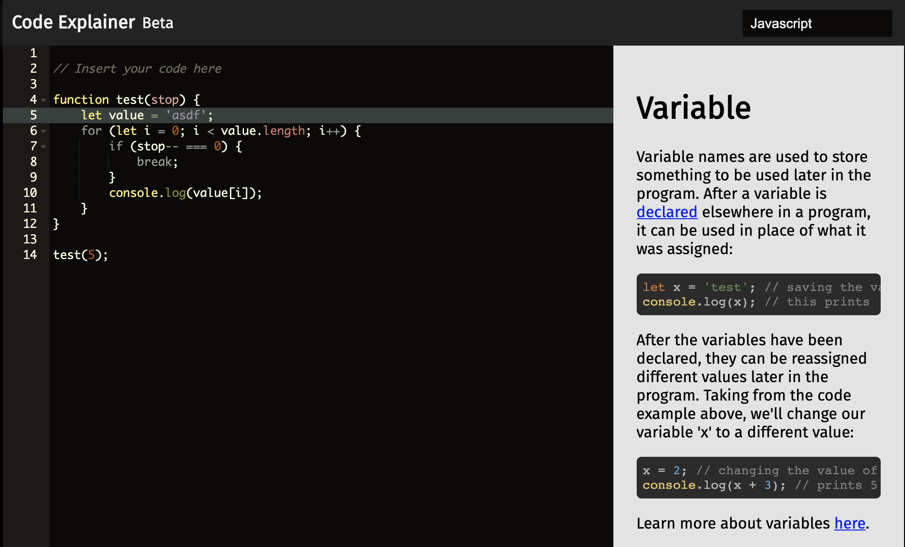

# Code Explainer

An online tool for beginner programmers to explain code.



## Installation

_Requires Node.js and npm to install_

To run the code locally, install the needed dependencies with `npm install` and start the application with `npm start`.
To run in development mode with nodemon and other developer tools, use `npm run dev` instead.

## Use and Function

The application runs primarily off of a set of JSON "Rules" that determine what each keyword links to. When the contents of the editor change, the list of needed keywords updates and a request is send to the app to retrive the given rules.

In order to be able to cover all possible keywords, the rules are divided into two primary collections: `tokenRules` and `regexRules`. The `tokenRules` are used for keywords that have a constant value such as JavaScript's `let` and `console`. The remaining types rely on both the type of token and a regular expression to decifer which rule to apply.

## Database Setup

1. Set the environment variables `DB_URI` to the database you wish to use.
2. Have the names of each of the following collection prefaced by the paired language in camelCase. Ex `javascriptTokenRules`
3. Follow the schemas setup in the `models` folder and as listed below

Each rule should follow the given format:

Token Rule:

```
{
  "tag": "unique-identifier",
  "token" : "storage.type:let",
  "tokenType" : "storage.type",
  "tokenValue" : "let",
  "html": "<p>I am displayed on the right</p>",
}
```

Regex Rule:

```
{
  "tag": "unique-identifier",
  "regex" : "\w+",
  "tokenType" : "storage.type",
  "html": "<p>I am displayed on the right</p>",
}
```

If the regex field is left empty, then the selected keyword will be identified by its `tokenType` only.

## Other Notes

The given environment variables can be used in setup:

ip address: `IP`
port number: `PORT`
environment: `NODE_ENV`
database url: `DB_URI`

## Licence

Code Explainer and Code Explainer Dashboard are released under the MIT Licence.
